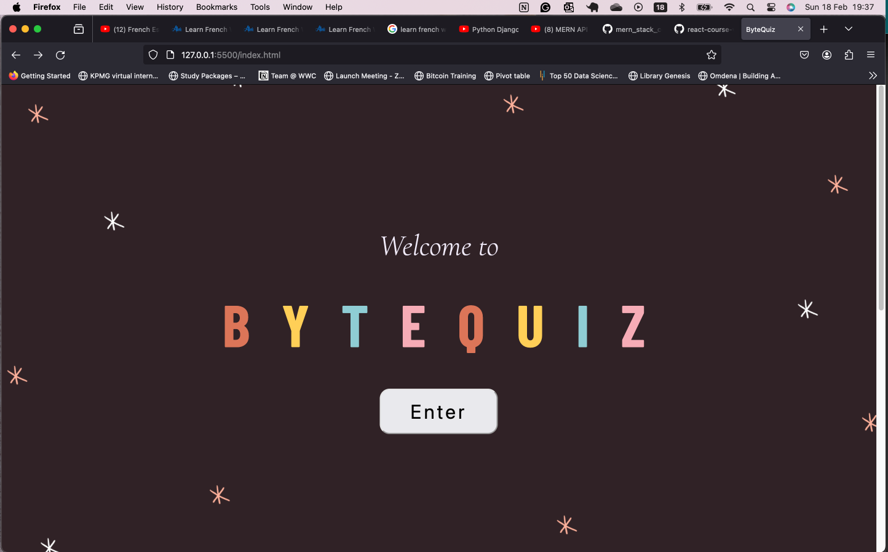
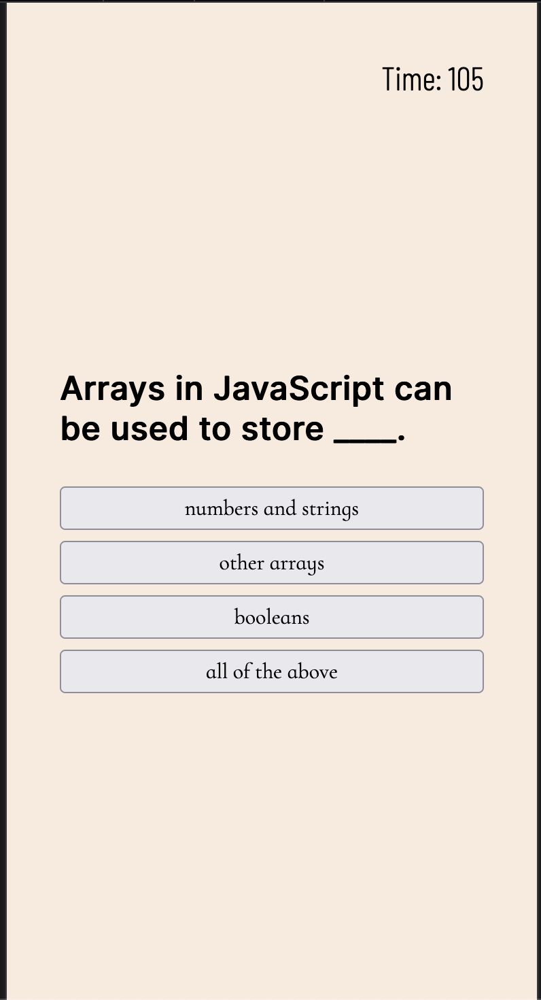
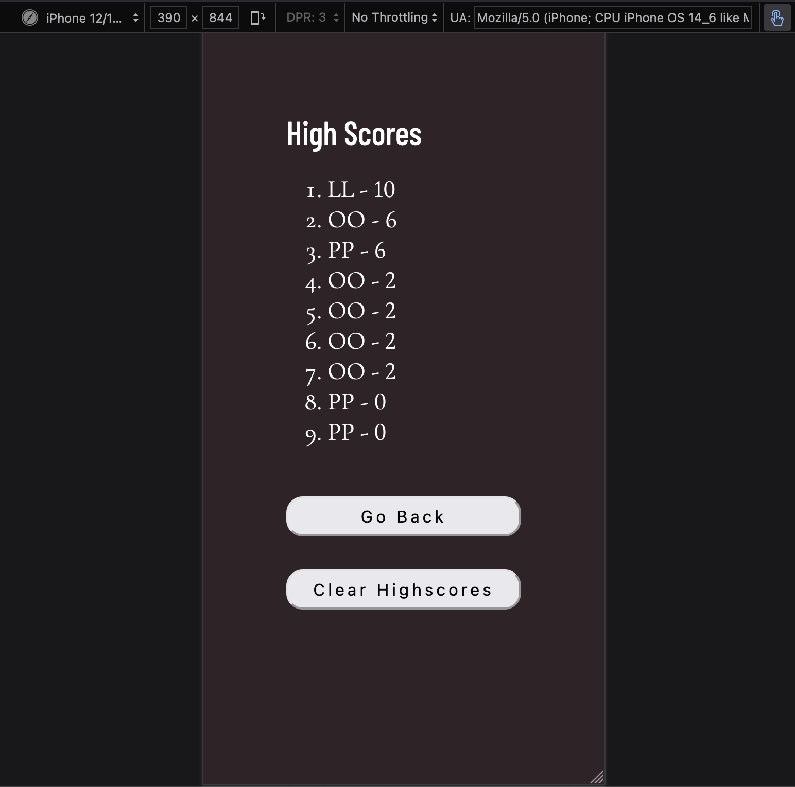

# ByteQuiz

This is a solution to a creating a Javascript Web API - Code Quiz assignment from SkillHat. _[SkillHat](https://skillhat.ca/)_ is the bridge between tech talent and industry needs.

## Table of contents

- [Overview](#overview)
  - [User Story](#user-story)
  - [Acceptance Criteria](#acceptance-criteria)
- [Quiz Features](#quiz-features)
- [Implementation Details](#implementation-details)
  - [Screenshot](#screenshot)
  - [Links](#links)
- [Challenges Overcome](#challenges-overcome)
- [Future Improvement](#future-improvement)
  - [Author](#author)
  - [Acknowledgements](#acknowledgements)

## Overview

### User Story

As a coding student:

- I WANT to take a timed quiz on JavaScript fundamentals that stores high scores
- SO THAT I can gauge my progress compared to my peers

### Acceptance Criteria

- GIVEN I am taking a code quiz
- WHEN I click the start button
- THEN a timer starts and I am presented with a question
- WHEN I answer a question
- THEN I am presented with another question
- WHEN I answer a question incorrectly
- THEN time is subtracted from the clock
- WHEN all questions are answered or the timer reaches 0
- THEN the game is over
- WHEN the game is over
- THEN I can save my initials and my score

## **Quiz Features** :

- Interactive quiz interface.
- Randomized questions to keep the quiz engaging.
- Timer functionality to add a sense of urgency.
- Immediate feedback on answer correctness.
- Sound effects for correct and incorrect answers.
- High score tracking and display.
- Ability to clear high scores.

## **Implementation Details** :

- Utilized HTML, CSS, and JavaScript.
- Organized code into separate files for better maintainability.
- Used local storage for high score persistence.
- Implemented dynamic rendering of questions and choices.
- Applied CSS styling for a visually appealing user interface.
- Implemented event listeners for user interaction.

### Screenshot

### Links

- [Solution GitHub URL](https://github.com/Abimbola-ai/ByteQuiz)
- [Live Site URL](https://abimbola-ai.github.io/ByteQuiz/ 'live site')

## **Challenges Overcome** :

- Handling asynchronous behavior, such as timer updates.
- Ensuring cross-browser compatibility for audio playback.
- Managing local storage and handling empty or invalid inputs.
- Optimizing performance for smooth user experience.

## **Future Improvements** :

- Adding more questions to expand the quiz bank.
- Implementing user authentication for personalized experiences.
- Enhancing accessibility features for users with disabilities.
- Integrating social media sharing for score bragging.
- Implementing responsive design for mobile devices.

## Author

- LinkedIn - [ojikutu-olajumoke](https://www.https://www.linkedin.com/in/ojikutu-olajumoke/)

## Acknowledgments

A big thanks to SkillHat for providing a platform to challenge and enhance my abilities. Thanks also to my frontend instructor [Edward Apostol](https://www.linkedin.com/in/edwardapostol/ 'Instructor') and Teaching assistants Babatunde Koiki, Daniel. Design inspiration from [Canva](https://www.canva.com/)
